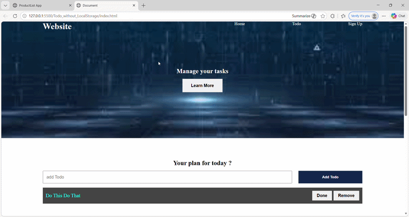
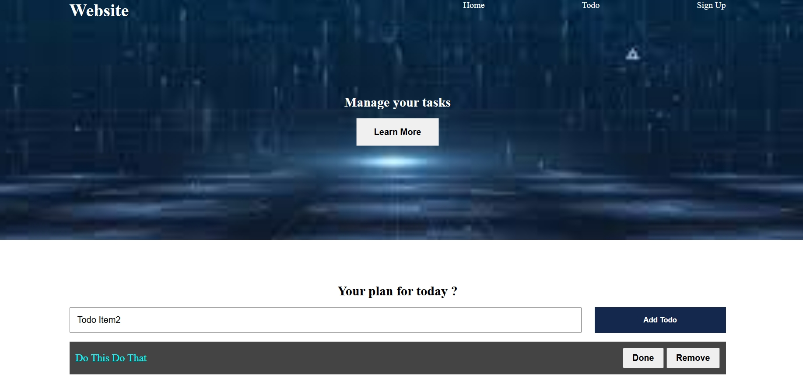
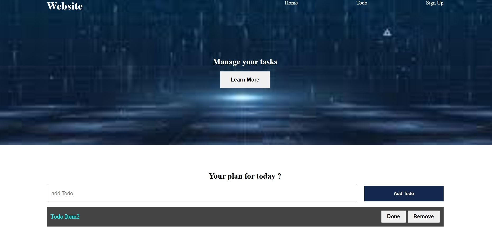
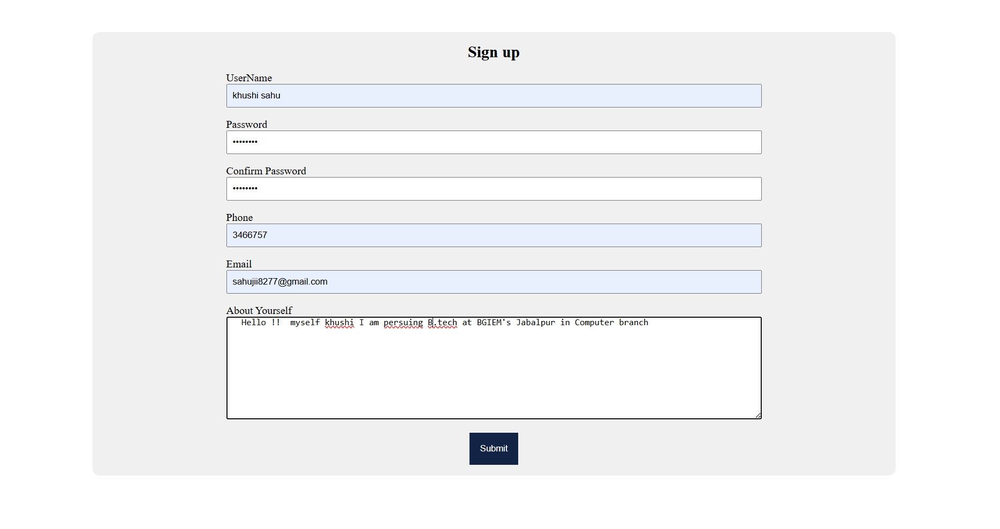
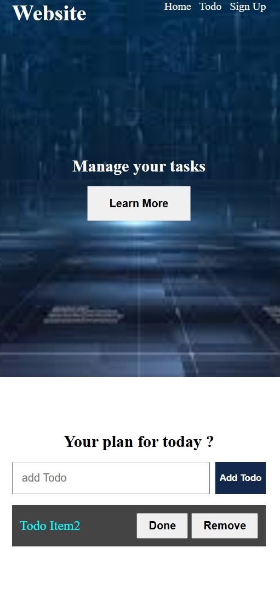

# 📝 JavaScript Todo App


A clean and interactive **Todo Application** built using **Vanilla JavaScript**, designed to demonstrate core frontend concepts like **DOM manipulation**, **event handling**, and dynamic UI updates without using any frameworks.

---

## 🚀 Live Demo

🌐 **Live App:** https://khushi-66.github.io/javascript-todo-app/
📂 **GitHub Repository:** https://github.com/khushi-66/javascript-todo-app

---

## 🎥 Live Preview



---

## 📌 Overview

This project focuses on building a **task management application from scratch** using pure JavaScript, without relying on frameworks like React.

It demonstrates:

* Dynamic UI rendering using DOM manipulation
* Handling user interactions (add, delete, complete)
* Managing application state manually
* Creating a responsive and clean user interface

---

## 🧠 Key Learnings

* Manipulating DOM elements dynamically
* Handling events such as clicks and inputs
* Managing application logic without frameworks
* Structuring JavaScript code efficiently
* Building real-world interactive applications

---

## 📸 Screenshots

### 🏠 Main Interface


### ✅ Task Management





### 🎯 User Interaction



### 📱 Mobile View



---

## ✨ Features

* ➕ Add new tasks
* ❌ Delete tasks
* ✔️ Mark tasks as completed
* ⚡ Instant UI updates
* 🎯 Clean and intuitive interface
* 📱 Fully responsive design

---

## ⚡ Performance & Optimization

* No external libraries (pure JavaScript)
* Fast DOM updates for smooth performance
* Lightweight and efficient code
* Minimal and maintainable structure

---

## 🛠️ Tech Stack

| Technology            | Usage     |
| --------------------- | --------- |
| **HTML5**             | Structure |
| **CSS3**              | Styling   |
| **JavaScript (ES6+)** | Logic     |

---

## 🌐 Deployment

This project is deployed using **GitHub Pages**, making it publicly accessible worldwide.

### 🚀 Deployment Process:

* Uploaded project to GitHub repository
* Enabled GitHub Pages from repository settings
* Selected main branch for deployment
* Generated a live public URL

---

## 📂 Project Structure

```bash id="p9l2k1"
javascript-todo-app/
│── index.html
│── style.css
│── script.js
│── screenshots/
│── assets/
│── README.md
```

---

## ⚙️ Installation & Setup

```bash id="u7y6t5"
git clone https://github.com/khushi-66/javascript-todo-app.git
cd javascript-todo-app
```

Open `index.html` in your browser 🚀

---

## 📈 Future Improvements

* ✏️ Edit task functionality
* 💾 LocalStorage integration
* 🔍 Search & filter tasks
* 🌙 Dark mode support
* 📅 Add due dates & reminders

---

## 💡 Real-World Use Cases

* Task management apps
* Productivity tools
* Daily planner applications
* Note-taking systems

---

## 👩‍💻 Author

**Khushi Sahu**
🔗 https://github.com/khushi-66

---

## ⭐ Support

If you like this project, give it a ⭐ on GitHub!
